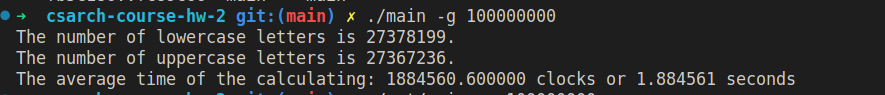
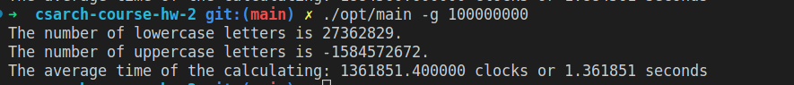

# ИДЗ №2 по АВС. Вариант №14, Семенов Никита БПИ214

## Условие задачи
>  Разработать программу, вычисляющую отдельно **число прописных и строчных букв** в заданной ASCII-строке.

## Отчет

Решение писалось сразу на 8 баллов. В отдельный модуль (`utils.c`) функция, решающая задачу, и ее вспомогательные
- **count_letters** - принимает текст, его размер, указатели на будущий ответ, считает количество строчных и прописных букв и запиывает их в переданные по указателю переменные;
- **is_lower** - возвращает *true*, если символ строчный, и *false* в противном случае;
- **is_upper** - возвращает *true*, если символ прописной, и *false* в противном случае.

Функции основном файле `main.c`
- **input_text** - вводит текст неизвестной длины с потока *fin*. Текст считывается в статический буфер;
- **gen_text** - генерирует текст заданной длины и записывает его в глобальный массив *generated_text*.

Опции компиляции прописаны в Makefile'ах.

 Аргументы командной строки:
 - `-i` - ввод/вывод производится через консоль;
 - `-f <input-file> <output-file>` - ввод/вывод производится из файлов `input-file`/`output-file`;
- `-g <size>` - вводимый массив генерируется программой. Вывод производится на стандартный поток.

Программа запускает функцию `count_letters` 5 раз, и вычисляет среднее время ее работы. Результат выводится в тактах и секундах.

## Рефакторинг сгенерированных ассемблерных файлов

Во всех функциях, включая main, убрано обращение на стек (в функции `main` на стеке хранятся переменные `lower_count` и `upper_count`, так как они передаются в функцию `count_letters` по указателю). Все операнды инструкций хранятся в регистрах. В некоторых случаях регистры, которые не должны изменяться вызванной функцией сохраняются на стек.

## Тестирование

Для тестирования эквивалентности оптимизированной и сгенерированных программ, приведены 5 тестов с различными данными. В папке `tests/` расположены входные данные тестов. В папке `tests/output` расположены файлы результаты работы сгененерированного ассемблерного кода. В папке `tests/opt_output` расположены результаты работы оптимизированной ассемблерной программы.

Также сгенерированная и оптимизированная программы запускались на больших сгенерированных данных (текст размера 100 000 000 символов). Ниже на скриншотах видно, что оптимизированная программа работает быстрее в ~1.3 раза.

Сгенерированная:

Оптимизированная:
